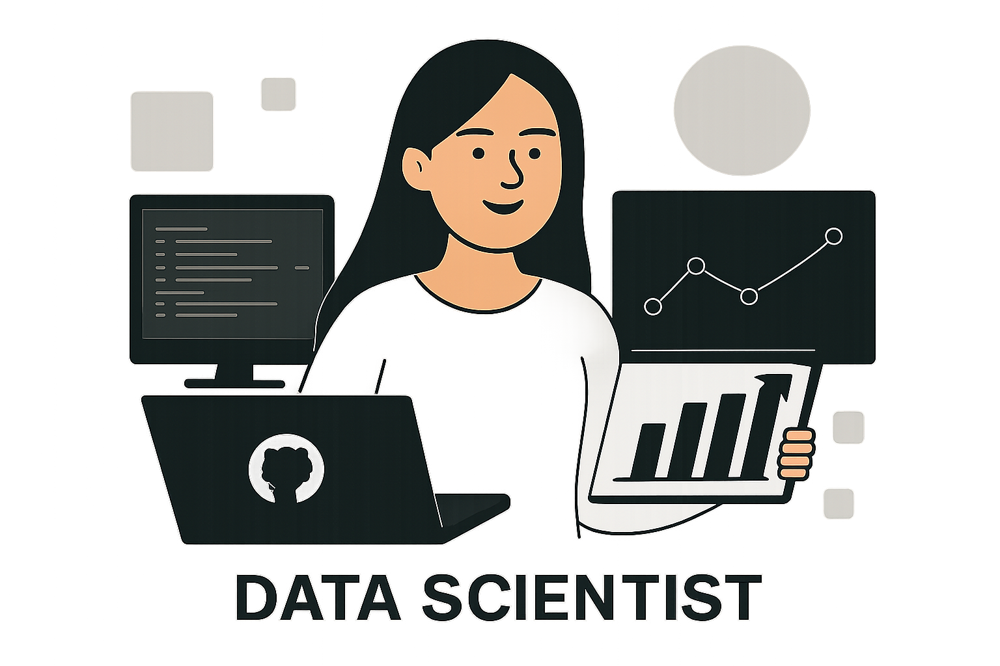

<!-- ===================== BANNER ===================== -->

  

<!-- ===================== NAME & TITLE ===================== -->
<h1 align="center">Hi 👋, I'm Alisha Verma</h1>
<h3 align="center">Data Scientist | Machine Learning Engineer | Generative AI | SQL | AWS Certified</h3>

  

---

## 👩‍💻 About Me

📚 PGP in Data Science (Generative AI Specialization) – Great Lakes Institute of Management 
🎓 MCA Graduate (CGPA: 9.1)  
📊 Strong foundation in Data Analysis, Machine Learning & Statistics  
🤖 Passionate about Generative AI & LLM-powered applications  
☁️ AWS Certified Cloud Practitioner  
🚀 Focused on building scalable, real-world AI solutions  
📈 Actively seeking Data Analyst / ML Engineer opportunities  

---

## 🛠️ Tech Stack

### 🔹 Programming & Databases

  

### 🔹 Data Analysis & Visualization

  

### 🔹 Machine Learning

  

### 🔹 Generative AI & NLP

  

### 🔹 Cloud & Deployment

  

### 🔹 Tools

  

---

## 🚀 Featured Projects

### 🔹 Airfare Price Prediction
- Built Random Forest & XGBoost models on **255K+ records**
- Improved performance from **R² 0.58 → 0.82**
- Performed feature engineering & hyperparameter tuning
- **Tech:** Python, Pandas, Scikit-Learn, XGBoost

---

### 🔹 RAG-Based Intelligent Chatbot
- Developed Retrieval-Augmented Generation system
- Integrated PDF & DOCX document querying
- Implemented semantic search using FAISS
- **Tech:** LangChain, Hugging Face, Streamlit

---

### 🔹 AI Resume Skill Matcher
- Built NLP-based resume-job description matching system
- Used semantic similarity scoring
- Improved screening efficiency
- **Tech:** Python, NLP, Pandas

---

### 🔹 Structural Defect Detection
- Developed ML-based defect detection system
- Applied computer vision techniques
- **Tech:** OpenCV, Scikit-Learn

---

## 📊 GitHub Analytics

  
  

---

## 🌱 Currently Learning
- Deep Learning & Neural Networks  
- MLOps & Model Deployment  
- Advanced LLM Architectures  

---

## 📫 Connect With Me

  
  &nbsp;&nbsp;
  

---

## ⚡ Professional Summary

I transform raw datasets into actionable insights and intelligent AI systems.  
With a strong analytical mindset and hands-on ML experience, I aim to contribute to data-driven teams solving real-world business problems.

